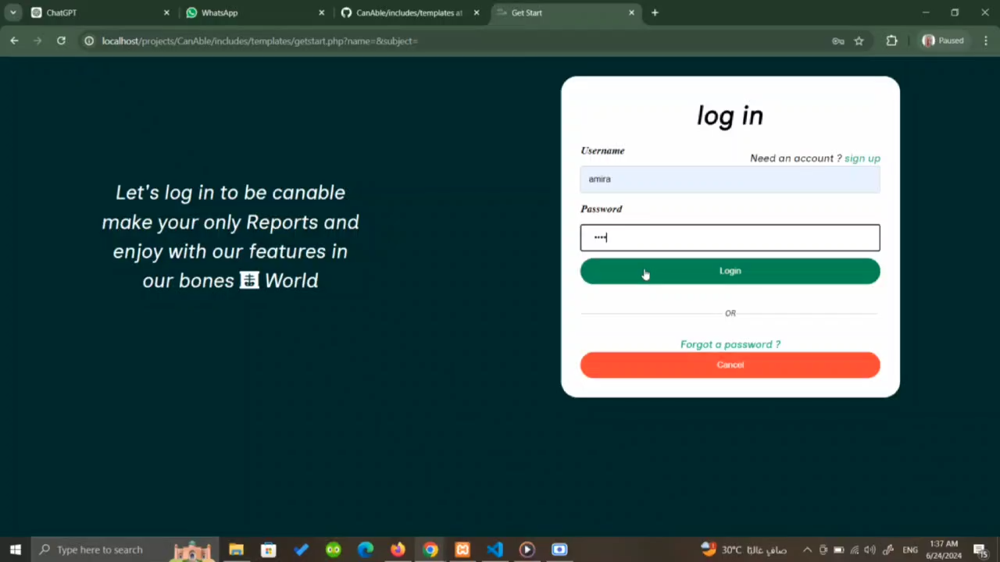
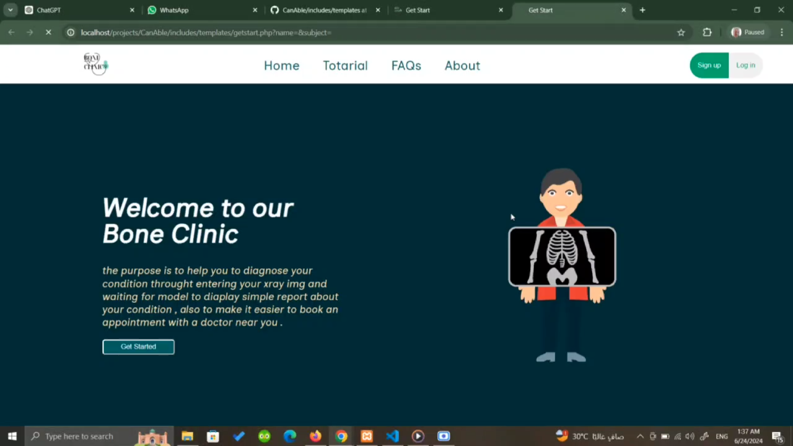
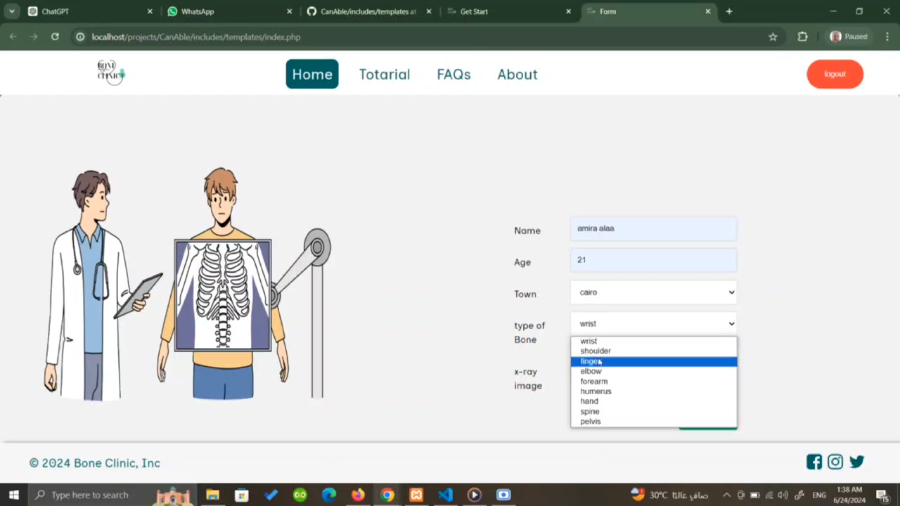
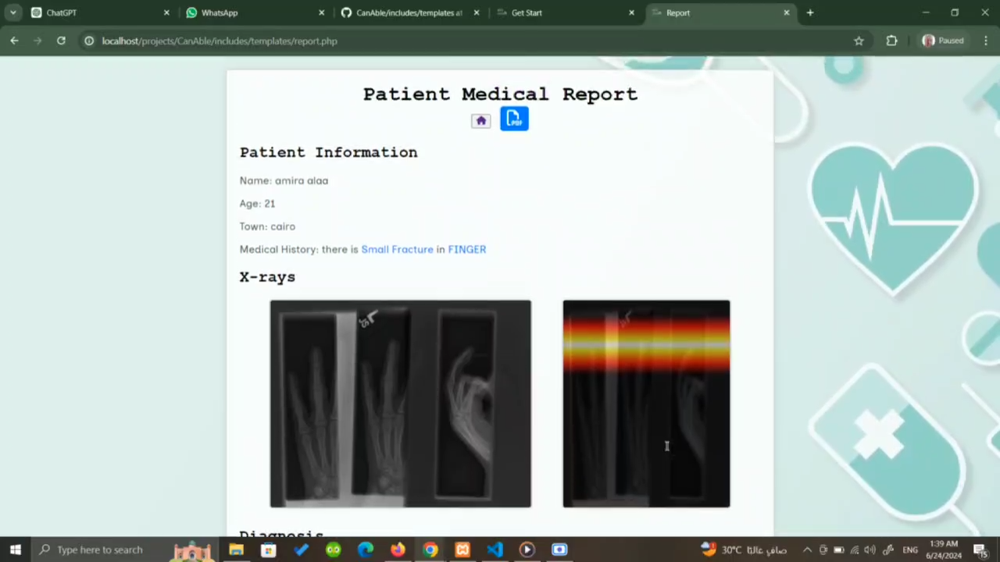

<div align="center">

# 🦴 Bone Fracture Detection

[](https://www.python.org/)
[](https://www.tensorflow.org/)
[](https://www.php.net/)
[](https://www.mysql.com/)
[](https://en.wikipedia.org/wiki/Convolutional_neural_network)
[](LICENSE)

**An AI-powered web application that detects bone fractures from X-ray images using deep learning, generating detailed medical reports to assist doctors in faster and more accurate diagnosis.**


</div>

---

## 🌟 Overview

Bone Fracture Detection is a web-based medical application designed to assist healthcare professionals by automatically analyzing X-ray images for signs of bone fractures. The system combines a **deep learning model** trained on fracture X-ray datasets with a **native PHP web interface**, enabling patients and doctors to upload X-ray images and receive an instant diagnostic report.

This project was developed as a **graduation project** with the goal of reducing diagnostic time and human error in fracture detection. By leveraging convolutional neural networks (CNNs), the model can identify fracture patterns in X-ray images with high accuracy, generating structured reports that highlight the detection results. The PHP backend orchestrates the workflow — receiving uploaded images, invoking the Python-based model via the terminal, and returning the formatted report to the user through a clean, responsive interface.

The system is designed to be a **decision-support tool**, not a replacement for professional medical judgment. It helps doctors save time by providing a rapid first-pass analysis, allowing them to focus on confirmed cases and treatment planning.

---

## ✨ Features

### 🔬 AI-Powered Fracture Detection
- Deep learning model (CNN) trained on X-ray fracture datasets
- Detects fracture presence in uploaded X-ray images
- Confidence score indicating the model's certainty level
- Supports common fracture types and bone regions

### 📋 Automated Report Generation
- Generates a structured medical report after each analysis
- Report includes: detection result, confidence percentage, and analysis timestamp
- Clean, printable report format for patient records
- Downloadable report output

### 🖼️ X-Ray Image Upload
- Simple drag-and-drop or file selection upload interface
- Supports standard medical image formats (JPEG, PNG, DICOM)
- Image validation and preprocessing before analysis
- Secure file handling with temporary storage

### 🌐 Web Interface
- Clean, responsive design accessible from any device
- Patient-friendly upload flow with step-by-step guidance

### 🔐 User Management
- Patient  registration/login
- Analysis history tracking per user
- Secure session management

---

## 🔄 How It Works

The application follows a straightforward pipeline: the user uploads an X-ray image through the PHP web interface, the backend invokes the deep learning model via the terminal, and the detection results are formatted into a medical report displayed back to the user.

```
┌─────────────────────────────────────────────────────────────────┐
│                        User (Patient/Doctor)                     │
│                    Uploads X-ray Image via Web                   │
└──────────────────────────┬──────────────────────────────────────┘
                           │
                           ▼
┌─────────────────────────────────────────────────────────────────┐
│                     PHP Web Interface                            │
│                                                                   │
│   1. Receives uploaded X-ray image                               │
│   2. Validates image format and size                             │
│   3. Saves image to temporary directory                          │
│   4. Executes Python model via terminal (shell_exec)             │
│   5. Captures model output (JSON result)                         │
│   6. Generates structured medical report                         │
│   7. Returns report to user                                      │
└──────────────────────────┬──────────────────────────────────────┘
                           │
                           ▼
┌─────────────────────────────────────────────────────────────────┐
│                   Deep Learning Model (Python)                   │
│                                                                   │
│   1. Loads and preprocesses the X-ray image                      │
│   2. Normalizes pixel values and resizes to model input size     │
│   3. Runs inference through the trained CNN                      │
│   4. Outputs prediction: Fracture / No Fracture + Confidence     │
│   5. Returns result as JSON to PHP backend                       │
└─────────────────────────────────────────────────────────────────┘
                           │
                           ▼
┌─────────────────────────────────────────────────────────────────┐
│                      Medical Report                              │
│                                                                   │
│   ┌─────────────────────────────────────────────┐               │
│   │  🦴 Bone Fracture Detection Report          │               │
│   │                                               │               │
│   │  Patient: John Doe                           │               │
│   │  Date: 2024-05-15                            │               │
│   │  Result: Fracture Detected                   │               │
│   │  Confidence: 94.7%                           │               │
│   │  Region: Upper Limb                          │               │
│   │                                               │               │
│   │  Note: This report is generated by an AI     │               │
│   │  system and should be reviewed by a          │               │
│   │  qualified medical professional.             │               │
│   └─────────────────────────────────────────────┘               │
└─────────────────────────────────────────────────────────────────┘
```

---

## 🧰 Tech Stack

| Category               | Technology                                                                  |
|------------------------|-----------------------------------------------------------------------------|
| **Web Backend**        |  PHP (Native)            |
| **Frontend**           | HTML5, CSS3, JavaScript, Bootstrap                                          |
| **AI / Deep Learning** |  Python, TensorFlow/Keras |
| **Model Architecture** | CNN (Convolutional Neural Network)                                          |
| **Database**           |  MySQL               |
| **Image Processing**   | OpenCV, PIL/Pillow, NumPy                                                   |
| **Server**             | Apache / Nginx (XAMPP or LAMP stack)                                        |
| **Model Deployment**   | Terminal execution via PHP `shell_exec()`                                   |

---

## 🧠 Deep Learning Model

The fracture detection model is a **Convolutional Neural Network (CNN)** trained on a dataset of labeled X-ray images (fracture vs. non-fracture). It takes a preprocessed X-ray image as input and outputs a classification with confidence score.

### Model Architecture

```
┌──────────────────────────────────────────────────────┐
│                    Input Layer                         │
│              (224 × 224 × 1 Grayscale)               │
└──────────────────────┬───────────────────────────────┘
                       │
┌──────────────────────▼───────────────────────────────┐
│              Convolutional Block 1                     │
│    Conv2D (32 filters, 3×3) → ReLU → MaxPool (2×2)   │
└──────────────────────┬───────────────────────────────┘
                       │
┌──────────────────────▼───────────────────────────────┐
│              Convolutional Block 2                     │
│    Conv2D (64 filters, 3×3) → ReLU → MaxPool (2×2)   │
└──────────────────────┬───────────────────────────────┘
                       │
┌──────────────────────▼───────────────────────────────┐
│              Convolutional Block 3                     │
│    Conv2D (128 filters, 3×3) → ReLU → MaxPool (2×2)  │
└──────────────────────┬───────────────────────────────┘
                       │
┌──────────────────────▼───────────────────────────────┐
│              Flatten → Dense → Dropout                 │
│         Flatten → Dense(128, ReLU) → Dropout(0.5)     │
└──────────────────────┬───────────────────────────────┘
                       │
┌──────────────────────▼───────────────────────────────┐
│                   Output Layer                         │
│          Dense(1, Sigmoid) → Fracture Probability      │
└──────────────────────────────────────────────────────┘
```

### How the Model is Called

The PHP backend invokes the model via terminal using `shell_exec()`:

```php
<?php
// PHP calls the Python prediction script
$imagePath = realpath($uploadedFilePath);
$command = escapeshellcmd(PYTHON_PATH . " " . MODEL_SCRIPT . " --image " . $imagePath);
$output = shell_exec($command);

// Parse JSON result from the model
$result = json_decode($output, true);

// $result contains:
// [
//     "prediction" => "Fracture" / "No Fracture",
//     "confidence" => 0.947,
//     "region" => "Upper Limb"
// ]
?>
```

---

## 📸 Screenshots







---

<div align="center">

⭐ If you found this project helpful, please give it a star!

</div>
